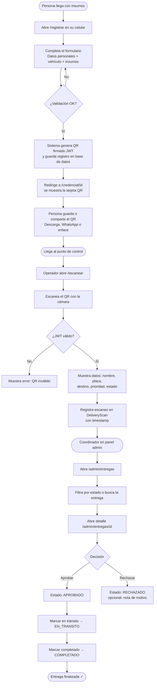
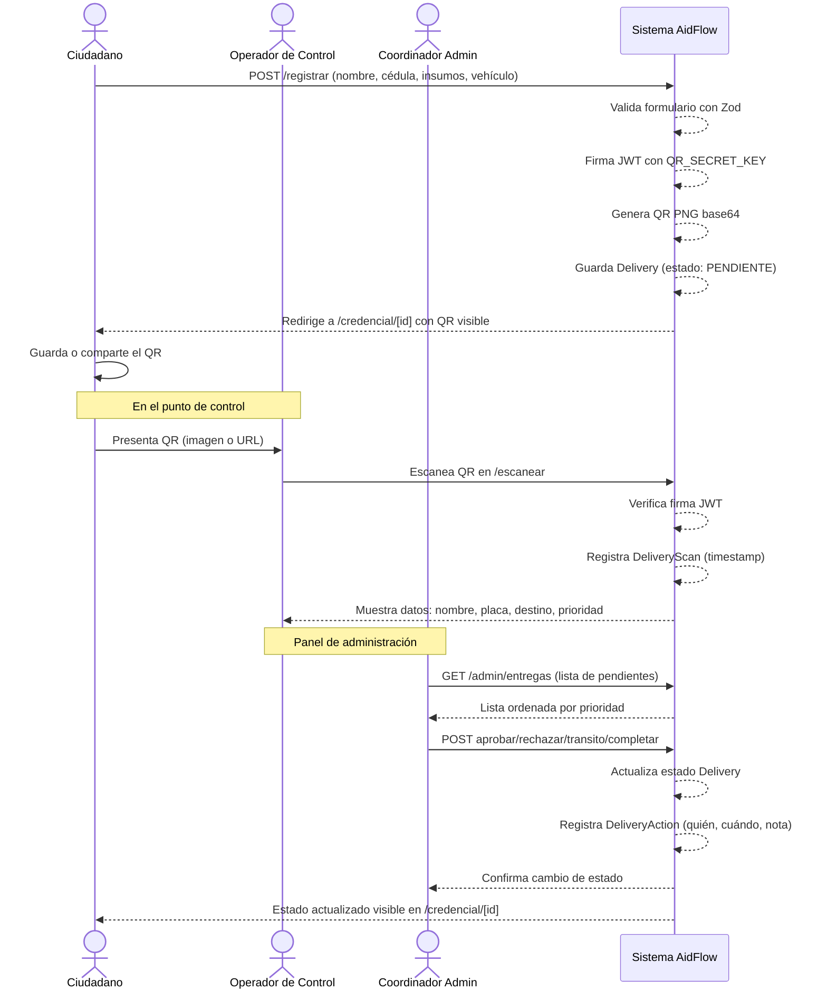
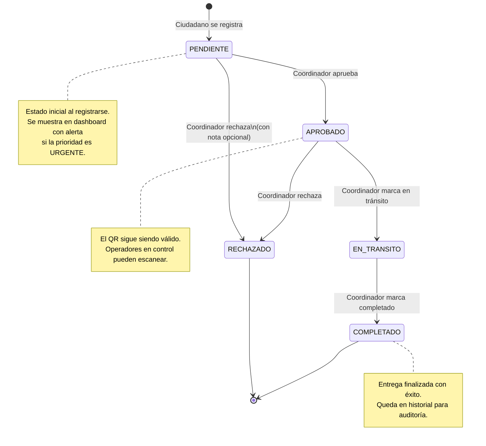

# AidFlow La Guaira — Funcionalidades del Sistema

> Sistema solidario de registro y control de entrega de insumos humanitarios.
> Desarrollado para coordinar operaciones de ayuda en La Guaira, Venezuela.

---

## Índice

1. [Visión general](#1-visión-general)
2. [Diagrama de flujo principal](#2-diagrama-de-flujo-principal)
3. [Interacción entre actores](#3-interacción-entre-actores)
4. [Estados de una entrega](#4-estados-de-una-entrega)
5. [Rutas y accesos](#5-rutas-y-accesos)
6. [Registro público](#6-registro-público)
7. [Credencial QR](#7-credencial-qr)
8. [Punto de control — Escaneo QR](#8-punto-de-control--escaneo-qr)
9. [Panel de administración](#9-panel-de-administración)
10. [Gestión de usuarios admin](#10-gestión-de-usuarios-admin)
11. [Exportación de datos](#11-exportación-de-datos)
12. [Modelo de datos](#12-modelo-de-datos)
13. [Roles y permisos](#13-roles-y-permisos)
14. [Stack tecnológico](#14-stack-tecnológico)

---

## 1. Visión general

AidFlow permite digitalizar el flujo de entrega de ayuda humanitaria en tres pasos:

```
[Persona se registra] → [Obtiene QR] → [Pasa el control] → [Coordinador marca entrega]
```

- **Sin instalar apps** — funciona en cualquier celular con navegador
- **Sin papel** — todo el proceso es digital
- **Trazabilidad completa** — cada escaneo y cambio de estado queda registrado
- **Seguridad** — los QR están firmados digitalmente con JWT y no pueden falsificarse

---

## 2. Diagrama de flujo principal



---

## 3. Interacción entre actores



---

## 4. Estados de una entrega



---

## 5. Rutas y accesos

| Ruta | Acceso | Descripción |
|------|--------|-------------|
| `/` | Público | Landing page con guía interactiva por tipo de usuario |
| `/registrar` | Público | Formulario de registro para obtener credencial QR |
| `/credencial/[id]` | Público | Visualización de la credencial QR generada |
| `/escanear` | Público | Scanner QR para operadores en puntos de control |
| `/login` | Público | Acceso al panel de administración |
| `/admin` | Admin | Dashboard con estadísticas en tiempo real |
| `/admin/entregas` | Admin | Listado completo de registros con filtros |
| `/admin/entregas/[id]` | Admin | Detalle de un registro + acciones de estado |
| `/admin/usuarios` | Solo SUPER_ADMIN | Gestión de usuarios administradores |
| `/api/export/entregas` | Admin | Descarga de datos en formato CSV |

---

## 6. Registro público

**Ruta:** `/registrar`

El formulario de registro es completamente público — no requiere cuenta ni autenticación. Cualquier persona puede completarlo.

### Campos del formulario

#### Información personal
| Campo | Tipo | Requerido | Notas |
|-------|------|-----------|-------|
| Nombre completo | Texto | Sí | Mínimo 2 caracteres |
| Cédula | Texto | Sí | Formato V-XXXXXXXX, se guarda en mayúsculas |
| Teléfono | Texto | No | |
| Dirección | Texto | No | |
| Rol | Selección | Sí | Donante / Transportista / Voluntario / Familiar |

#### Datos del vehículo *(solo si rol = Transportista)*
| Campo | Tipo | Requerido | Notas |
|-------|------|-----------|-------|
| Tipo de vehículo | Selección | Sí | Auto / Moto / Camión / Otro |
| Placa | Texto | Sí | Se guarda en mayúsculas |
| Marca | Texto | No | |
| Color | Texto | No | |
| Nombre del conductor | Texto | No | |

#### Información de la entrega
| Campo | Tipo | Requerido | Notas |
|-------|------|-----------|-------|
| Sector de destino | Texto | Sí | |
| Nombre del destinatario | Texto | Sí | Mínimo 2 caracteres |
| Tipo de ayuda | Selección | Sí | Medicamentos / Alimentos / Agua / Otro |
| Cantidad | Texto | Sí | Descripción libre (ej: "20 kg de arroz") |
| Prioridad | Selección | No | Urgente / Alta / Normal (defecto: Normal) |
| Notas adicionales | Texto largo | No | Máximo 500 caracteres |

### Proceso al enviar

1. Validación con Zod (incluyendo reglas condicionales: placa obligatoria para transportistas)
2. Firma del payload con JWT usando clave secreta (`QR_SECRET_KEY`)
3. Creación del registro en base de datos con estado inicial `PENDIENTE`
4. Generación de imagen QR en base64 (PNG 300×300 px, fondo blanco, tinta azul)
5. Actualización del registro con el token final y la imagen
6. Redirección a `/credencial/[id]`

---

## 7. Credencial QR

**Ruta:** `/credencial/[id]`

Página pública y compartible que muestra la credencial digital de un registro.

### Contenido mostrado

- **Código QR** — imagen PNG generada al registrarse, con el JWT firmado
- **Badge de prioridad** — color según nivel (rojo = Urgente, naranja = Alta, gris = Normal)
- **Estado actual** — Pendiente / Aprobado / En tránsito / Completado / Rechazado
- **Datos personales** — nombre completo, cédula, rol
- **Datos del vehículo** — placa, marca, color, tipo (solo si es transportista)
- **Datos de la entrega** — sector destino, destinatario, tipo y cantidad de insumos
- **Fecha y hora** de registro

### Uso recomendado

- La persona puede tomar captura de pantalla del QR para usarlo sin internet
- La URL puede compartirse por WhatsApp para que otros la abran
- El estado se actualiza en tiempo real al recargar la página

### Contenido del JWT firmado

```json
{
  "deliveryId": "clxxxxx",
  "cedula": "V-12345678",
  "fullName": "Juan Pérez",
  "personRole": "TRANSPORTISTA",
  "plate": "AB123CD",
  "destSector": "La Maiquetía",
  "recipient": "María Pérez",
  "aidType": "ALIMENTOS",
  "priority": "URGENTE",
  "createdAt": "2026-06-28T10:00:00.000Z",
  "iss": "aidflow-laguaira"
}
```

---

## 8. Punto de control — Escaneo QR

**Ruta:** `/escanear`

Herramienta para operadores en puntos de control. No requiere autenticación.

### Funcionamiento

1. El operador abre `/escanear` en su celular
2. Activa la cámara y apunta al QR de la persona
3. El sistema verifica la firma del JWT
4. Si es válido, muestra los datos completos del registro
5. Registra automáticamente el escaneo con fecha y hora

### Información mostrada al escanear

- Nombre completo y cédula
- Rol (Donante / Transportista / Voluntario / Familiar)
- Placa del vehículo (si aplica)
- Sector de destino y destinatario
- Tipo y cantidad de insumos
- Nivel de prioridad (con color destacado)
- Estado actual del registro

### Validaciones de seguridad

- Verifica la firma criptográfica del JWT — QRs alterados o falsos son rechazados
- Muestra error si el registro está en estado `RECHAZADO`
- Cada escaneo queda registrado en la tabla `DeliveryScan` con timestamp

### Registro de auditoría por escaneo

Cada vez que se escanea un QR se guarda:
- ID del registro escaneado
- Fecha y hora exacta
- Ubicación (si el operador la indica)

---

## 9. Panel de administración

**Acceso:** `/login` → `/admin`
**Requiere:** cuenta de administrador activa

### 6.1 Dashboard principal (`/admin`)

- Contadores de registros por estado: Pendientes / Aprobados / En tránsito / Completados / Rechazados
- Total de registros
- Registros de los últimos 7 días
- **Alerta destacada** si hay entregas URGENTES en estado Pendiente o Aprobado
- Lista de los 10 registros más recientes con enlace directo al detalle

### 6.2 Listado de entregas (`/admin/entregas`)

- Lista completa de todos los registros
- Ordenados por prioridad (Urgente primero) y luego por fecha descendente

#### Filtros disponibles
- Por estado: Todos / Pendiente / Aprobado / En tránsito / Completado / Rechazado
- Por búsqueda de texto: nombre, cédula, placa, sector de destino (búsqueda insensible a mayúsculas)
- Los filtros son combinables (estado + búsqueda simultáneos)

#### Información en la lista
- Badge de prioridad con color
- Nombre, cédula y rol
- Placa (si aplica), sector destino, cantidad
- Estado con color y fecha de registro

### 6.3 Detalle de entrega (`/admin/entregas/[id]`)

Vista completa de un registro con todos sus datos y acciones disponibles.

#### Acciones de cambio de estado

| Acción | Estado resultante | Disponibilidad |
|--------|------------------|----------------|
| Aprobar | APROBADO | Desde Pendiente |
| Rechazar | RECHAZADO | Con nota opcional |
| Marcar en tránsito | EN_TRANSITO | Desde Aprobado |
| Marcar completado | COMPLETADO | Desde En tránsito |

Cada acción:
- Actualiza el estado del registro
- Crea una entrada en `DeliveryAction` con el ID del admin, timestamp y nota (si aplica)
- Invalida la caché de Next.js para que el dashboard y la credencial reflejen el nuevo estado

#### Historial de acciones

Muestra cronológicamente todos los cambios de estado con:
- Nombre y email del administrador que realizó la acción
- Timestamp exacto
- Nota adjunta (si fue un rechazo con motivo)

#### Historial de escaneos

Muestra los últimos 10 escaneos del QR con fecha y hora.

---

## 10. Gestión de usuarios admin

**Ruta:** `/admin/usuarios`
**Requiere:** rol `SUPER_ADMIN`

### Funcionalidades

#### Ver usuarios
- Lista de todos los administradores del sistema
- Muestra nombre, email, rol y estado (activo/inactivo)
- Ordenados por fecha de creación (más nuevos primero)

#### Crear nuevo usuario
Formulario inline con:
- Nombre completo
- Email
- Contraseña temporal (mínimo 8 caracteres, hasheada con bcrypt)
- Rol: Administrador (`ADMIN`) u Operador (`OPERADOR`)

> El SUPER_ADMIN no puede ser asignado desde la interfaz — solo existe el creado por seed inicial.

#### Activar / Desactivar usuario
- Toggle por usuario individual
- Un usuario inactivo no puede iniciar sesión
- No elimina el registro ni su historial de acciones

---

## 11. Exportación de datos

**Endpoint:** `GET /api/export/entregas`
**Requiere:** sesión de administrador activa

Descarga un archivo CSV con todos los registros del sistema.

### Columnas exportadas

```
Fecha, Nombre, Cédula, Teléfono, Rol,
Placa, Tipo Vehículo, Marca, Color, Conductor,
Sector Destino, Destinatario, Tipo Ayuda, Cantidad, Prioridad, Estado, Notas
```

- Ordenado por prioridad (Urgente primero) y luego por fecha descendente
- Fechas en formato venezolano (`es-VE`)
- Nombre de archivo: `aidflow-entregas-YYYY-MM-DD.csv`
- Codificación UTF-8 con comillas en todos los campos para compatibilidad con Excel

---

## 12. Modelo de datos

### Delivery (Registro de entrega)

```
id            — identificador único (cuid)
fullName      — nombre completo de la persona
cedula        — número de cédula (mayúsculas)
phone         — teléfono (opcional)
address       — dirección (opcional)
personRole    — DONANTE | TRANSPORTISTA | VOLUNTARIO | FAMILIAR
vehicleType   — AUTO | MOTO | CAMION | OTRO (opcional, solo transportistas)
plate         — placa del vehículo (mayúsculas, opcional)
brand         — marca del vehículo (opcional)
color         — color del vehículo (opcional)
driverName    — nombre del conductor (opcional)
destSector    — sector de destino
recipient     — nombre del destinatario
aidType       — MEDICAMENTOS | ALIMENTOS | AGUA | OTRO
quantity      — descripción de la cantidad
priority      — URGENTE | ALTA | NORMAL
notes         — notas adicionales (opcional)
qrToken       — JWT firmado con payload de la entrega (único)
qrCode        — imagen QR en base64 PNG
status        — PENDIENTE | APROBADO | EN_TRANSITO | COMPLETADO | RECHAZADO
createdAt     — fecha de registro
updatedAt     — última modificación
```

### DeliveryScan (Registro de escaneo)

```
id            — identificador único
deliveryId    — referencia al registro
scannedAt     — fecha y hora del escaneo
location      — ubicación del punto de control (opcional)
deviceInfo    — información del dispositivo (opcional)
operatorId    — referencia al operador (opcional)
```

### DeliveryAction (Historial de acciones)

```
id            — identificador único
deliveryId    — referencia al registro
action        — estado al que se cambió
adminId       — referencia al administrador que realizó la acción
note          — nota adjunta (útil para rechazos)
timestamp     — fecha y hora de la acción
```

### User (Administrador)

```
id            — identificador único
name          — nombre del administrador
email         — email (único, usado para login)
password      — contraseña hasheada con bcrypt (12 rounds)
role          — SUPER_ADMIN | ADMIN | OPERADOR
isActive      — si puede iniciar sesión
createdAt     — fecha de creación
```

---

## 13. Roles y permisos

| Funcionalidad | Público | OPERADOR | ADMIN | SUPER_ADMIN |
|---------------|---------|----------|-------|-------------|
| Registrarse | ✅ | ✅ | ✅ | ✅ |
| Ver credencial QR | ✅ | ✅ | ✅ | ✅ |
| Escanear QR en control | ✅ | ✅ | ✅ | ✅ |
| Ver dashboard | — | ✅ | ✅ | ✅ |
| Ver listado de entregas | — | ✅ | ✅ | ✅ |
| Ver detalle de entrega | — | ✅ | ✅ | ✅ |
| Aprobar / Rechazar entrega | — | ✅ | ✅ | ✅ |
| Marcar en tránsito / completado | — | ✅ | ✅ | ✅ |
| Exportar CSV | — | ✅ | ✅ | ✅ |
| Ver usuarios admin | — | — | — | ✅ |
| Crear usuarios admin | — | — | — | ✅ |
| Activar / Desactivar usuarios | — | — | — | ✅ |

### Credenciales iniciales (seed)

Al correr `npm run db:seed` se crea el primer administrador:

```
Email:      ftorresbaeza@gmail.com
Contraseña: AidFlow2024!
Rol:        SUPER_ADMIN
```

---

## 14. Stack tecnológico

| Capa | Tecnología |
|------|-----------|
| Framework | Next.js 16 (App Router) |
| Lenguaje | TypeScript |
| Estilos | TailwindCSS 3 |
| Base de datos | PostgreSQL (Neon serverless) |
| ORM | Prisma 6 |
| Autenticación | Auth.js v5 (Credentials provider) |
| Firma QR | `jose` (JWT HS256) |
| Generación QR | `qrcode` (PNG base64) |
| Escaneo QR | `jsqr` + cámara web nativa |
| Hashing contraseñas | `bcryptjs` (12 rounds) |
| Deploy | Vercel (serverless) |

### Variables de entorno requeridas

```env
DATABASE_URL        # Neon connection string (pooled para Vercel serverless)
AUTH_SECRET         # Secreto para Auth.js (openssl rand -base64 32)
QR_SECRET_KEY       # Secreto para firmar JWTs de QR (distinto al anterior)
NEXTAUTH_URL        # URL pública del sistema (ej: https://aidflow-laguaira.vercel.app)
```

---

*Documento generado el 2026-06-28. Versión 1.1 — incluye diagramas de flujo y secuencia de actores.*
